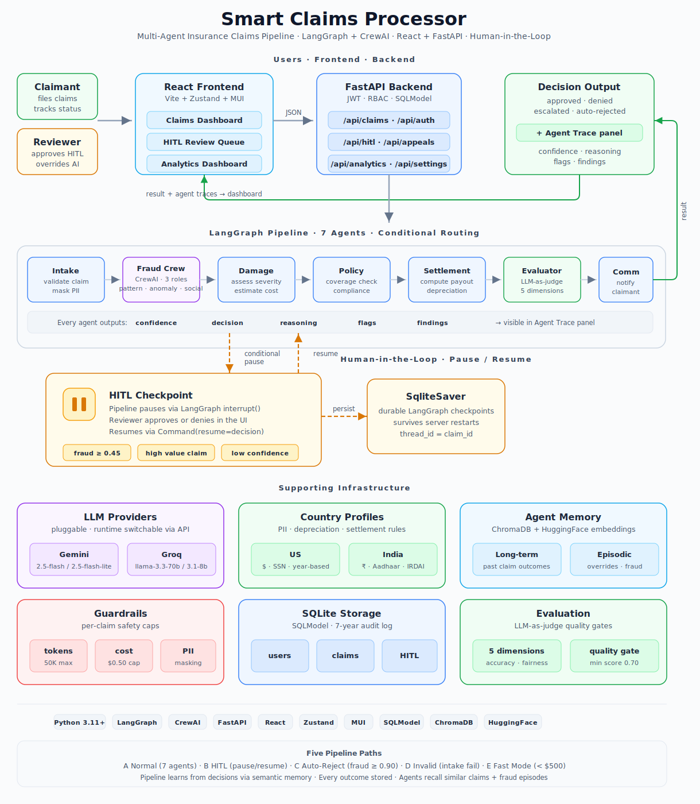
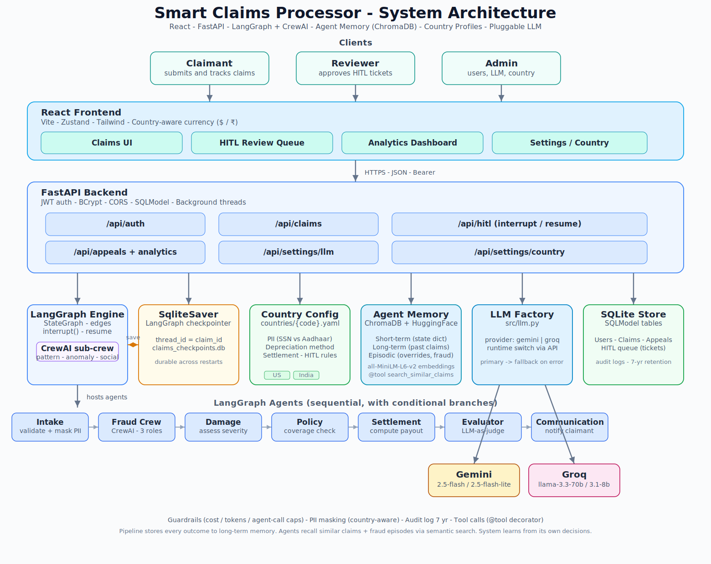
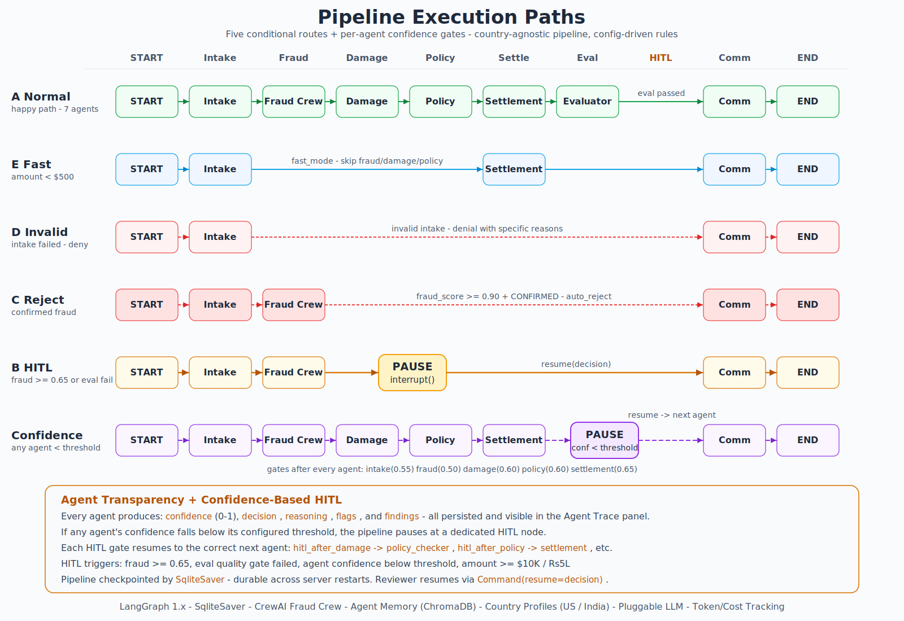

> **Learn AI/ML interactively at [AI-ML Companion](https://aimlcompanion.ai/)** - Guided walkthroughs, architecture decisions, hands-on challenges, and narrated overviews for every project.

> **Explore the blog for this project [Blog Link](https://aimlcompanion.ai/module/aiAgents/smartClaimsProcessor)**

# Smart Claims Processor

> **Who this is for** - anyone learning how multi-agent AI systems (LangGraph + CrewAI), production guardrails (cost caps, token limits, PII masking), human-in-the-loop approvals (interrupt/resume with durable checkpointing), agentic evaluation (LLM-as-judge), agent memory (ChromaDB + semantic search), pluggable LLM providers, and country-aware configuration fit together in a real-world full-stack app. Basic Python + a terminal is all you need.

> **Using Claude Code?** This project is fully set up for [Claude Code](https://claude.ai/code) - custom slash commands (`/test`, `/submit-claim`, `/reset-data`), safety hooks, permission rules, and a `CLAUDE.md` context file. See the **[Claude Code Guide](docs/claude-code-guide.md)** to learn how to use skills, hooks, memory, subagents, and more to work with this codebase effectively.



A production-style **multi-agent insurance claims system** built with **LangGraph** (orchestration) and **CrewAI** (fraud detection). A claimant submits a claim through a React UI, and the backend runs it through **7 specialist agents** - intake validation, fraud detection (3-agent CrewAI crew), damage assessment, policy compliance, settlement calculation, LLM-as-judge evaluation, and claimant notification.

**What makes it more than a demo:**

- **Transparent decisions** - every agent outputs confidence, reasoning, flags, and findings, visible in an expandable Agent Trace panel. No black boxes.
- **Human-in-the-Loop** - risky claims (high fraud score, high value, or low agent confidence) **pause mid-pipeline** via LangGraph's `interrupt()` and wait for a human reviewer. The reviewer's decision resumes the pipeline from the exact checkpoint, durably persisted by `SqliteSaver`.
- **Per-agent confidence gates** - if any agent is uncertain, the pipeline pauses at that step and asks a human before proceeding.
- **Pluggable LLMs** - switch between Gemini 2.5 Flash and Groq Llama 3.3 70B at runtime.
- **Country-aware** - US and India profiles with different PII fields, depreciation methods, settlement rules, currencies, and HITL thresholds.

---

## What, Why, When, How

| | |
|---|---|
| **What** | Multi-agent claims pipeline with a React frontend, FastAPI backend, LangGraph orchestration, CrewAI fraud sub-crew, and native pause/resume HITL (Human-In-The-Loop). |
| **Why** | Demonstrates the *hard* parts of production agentic systems: cost/token guardrails, PII masking, LLM-as-judge evaluation, role-based approvals, and checkpointed pause/resume - not a toy demo. |
| **When** | Use it as a reference when you need to build a workflow where some decisions are automatic and some must be escalated to humans with full context. |
| **How** | `uv` installs deps, a single `.env` selects Gemini or Groq as the LLM, and two commands (`uvicorn` + `npm run dev`) start the full stack. First install takes a few minutes due to ML model downloads. |

---

## Features

- **Multi-agent pipeline** - LangGraph state machine with 7 agents, CrewAI sub-crew for fraud (pattern analyst, anomaly detector, social validator).
- **Per-agent transparency** - every agent outputs confidence, reasoning, flags, and findings. All persisted to DB and visible in an expandable **Agent Trace panel** in the claim detail view. No black-box decisions.
- **Confidence-based HITL at every step** - configurable per-agent confidence thresholds (`configs/base.yaml` -> `confidence_gates`). If any agent's confidence drops below its threshold, the pipeline pauses at a dedicated HITL node for that agent and resumes to the correct next agent after review.
- **Pluggable LLM provider** - switch between **Gemini 2.5 Flash** and **Groq Llama 3.3 70B** via `.env` or the `/api/settings/llm` endpoint at runtime. Models are verified non-deprecated as of 2026-04.
- **Manual-approval HITL** - high-risk/high-value claims pause at an `interrupt()` checkpoint. A reviewer approves via the UI, the pipeline resumes with their decision, durably persisted by LangGraph's `SqliteSaver`.
- **Token/cost tracking** - LLM token usage and estimated cost tracked per-pipeline-run via a LangChain callback handler. Visible in claim details as "Total LLM Cost (USD)".
- **Denial transparency** - denied claims show specific reasons to both claimant and reviewer. Communication agent is instructed to always include concrete denial reasons, not generic messages.
- **Role-based auth** - JWT + bcrypt, seeded `admin / admin123`, roles: `user`, `reviewer`, `admin`.
- **Guardrails** - per-claim caps on agent calls, tokens, and cost, PII masking before LLM calls, 7-year audit log.
- **Country-aware currency** - all agent prompts, frontend labels, and amounts use the active country's currency symbol ($ or ₹). LLM cost is always shown in USD.
- **Analytics** - approval rate, HITL rate, cost breakdown, fraud trends, evaluator pass rate.
- **Agent memory** - three-tier memory using ChromaDB + HuggingFace embeddings (`all-MiniLM-L6-v2`): short-term (LangGraph state), long-term (past claim outcomes for similar-claim retrieval), episodic (human overrides, confirmed fraud, quality gate failures). Agents call `search_similar_claims` and `search_fraud_episodes` via LangChain `@tool` decorator - the LLM decides when to search memory, not the code.
- **React frontend** - Vite + Zustand + MUI (Material UI), mirrors the full API surface (claims, appeals, HITL queue, analytics).
- **Test data** - sample claims for all 5 pipeline paths in both US and India (`data/sample_claims/test_all_paths_*.json`).

---

## Architecture





---

## Prerequisites

- **Python 3.11+**
- **Node.js 18+** (for the frontend)
- **[uv](https://docs.astral.sh/uv/)** - modern Python env + package manager. Install once:
  ```bash
  pip install uv                   # easiest if you already have Python

  # Or install standalone:
  # Windows PowerShell
  powershell -c "irm https://astral.sh/uv/install.ps1 | iex"
  # Linux / macOS
  curl -LsSf https://astral.sh/uv/install.sh | sh
  ```
- **One LLM API key** (free tier works). Default provider is **Groq**:
  - Groq (default) -> <https://console.groq.com/keys>
  - Gemini (alternative) -> <https://aistudio.google.com/app/apikey>
- **Internet access on first run** - `sentence-transformers` downloads the HuggingFace `all-MiniLM-L6-v2` embedding model (~80 MB) the first time the backend starts. Subsequent runs use the cached model.

---

## Quickstart

> **Tip:** After cloning, open the project folder in **VS Code** and use the built-in terminal (`` Ctrl+` ``) to run all commands below. This gives you split terminals for backend + frontend side by side.

```bash
# 1. Clone and open project folder in VS Code (or any IDE)
git clone https://github.com/genieincodebottle/aiml-companion.git
cd aiml-companion/projects/smart-claims-processor

# 2. Create venv + install backend deps in the VSCode (or any IDE)
uv venv
.venv\Scripts\activate           # Windows (cmd / PowerShell)
#source .venv/bin/activate       # Linux / macOS


uv pip install -r requirements.txt
# ⏳ First install takes a few minutes - sentence-transformers pulls PyTorch + the
#    all-MiniLM-L6-v2 embedding model (~80 MB download, cached after first run).

# 3. Configure env (Copy the env details in actual .env file)
copy .env.example .env                    # Windows
#cp .env.example .env                     # Linux / macOS


# 4. Edit .env - set your LLM API key
#    The default provider is groq. Paste your key next to GROQ_API_KEY=
#    Or switch to Gemini: set LLM_PROVIDER=gemini and paste your key next to GOOGLE_API_KEY=
#
#    The default country is india (amounts in ₹, IRDAI rules).
#    To use US mode instead: set COUNTRY=us in .env

# 5. Generate a strong JWT signing key and write it to .env
python scripts/generate_secret_key.py        # fills API_SECRET_KEY if missing

# 6. Seed test insurance policies (US + India) for experimenting with UI with valid dates
python scripts/seed_policies.py

# 7. Start the backend (port 8000)
uvicorn api.main:app --port 8000
```

In a **second terminal (You can do split terminal in the VSCode)**, start the frontend (no venv needed - this is Node.js):

```bash
cd aiml-companion/projects/smart-claims-processor/frontend
npm install
npm run dev        # starts http://localhost:3000
```

> **Important:** The backend must be running before you open the frontend. Vite proxies all `/api` requests to `localhost:8000`, so if the backend is down you'll see network errors.

Open <http://localhost:3000>. The backend seeds four dev accounts on first startup so every role in the approval flow is testable immediately:

| Username    | Password     | Role       | Use it for                                    |
|-------------|--------------|------------|-----------------------------------------------|
| `admin`     | `admin123`   | `admin`    | manage users, switch LLM provider, view all   |
| `reviewer1` | `review123`  | `reviewer` | approve HITL tickets (primary approver)       |
| `reviewer2` | `review123`  | `reviewer` | second approver for parallel testing          |
| `claimant`  | `claim123`   | `user`     | file claims, track own status                 |

> These are dev-only credentials. Change them (or delete them via `DELETE /api/auth/users/{id}`) before any non-local deployment. They're defined in [api/security.py](api/security.py) -> `SEED_USERS`.

### Try it end-to-end (5-minute walkthrough)

1. **Log in as `claimant` / `claim123`** and click "Submit Claim".
2. **Fill in a test claim.** You can type your own or copy values from one of the sample files in `data/sample_claims/`. Since the default country is India, use `data/sample_claims/test_all_paths_india.json`. To trigger the HITL flow, use the `path_b_hitl_high_fraud` entry - paste the field values into the form.
3. **Click Submit.** The pipeline runs. Watch the backend terminal - you'll see each agent executing. If the claim triggers HITL, the status will change to `pending_human_review`.
4. **Log out, then log in as `reviewer1` / `review123`.** Open the HITL Queue page. You'll see the pending ticket with the AI's analysis, fraud score, and a review brief.
5. **Click Approve or Deny.** The pipeline resumes from its checkpoint, runs the remaining agents, and the claim reaches a final status.
6. **Check the claim detail page.** Expand the Agent Trace panel to see every agent's structured output - confidence scores, reasoning, flags, and findings.

> **Tip:** The sample files in `data/sample_claims/` cover all 5 pipeline paths (normal approval, HITL, auto-reject, intake failure, fast mode). Each entry has `_path`, `_trigger`, and `_expected_outcome` fields that explain what should happen.

### Useful scripts

| Command | What it does |
|---|---|
| `pytest tests/ -q` | Run test suite |
| `python scripts/seed_policies.py` | Re-seed test policies (US + India) |
| `python scripts/clean_data.py` | Clean claims/appeals/HITL (keeps users + policies) |
| `python scripts/clean_data.py --all` | Full reset (deletes everything including users) |
| `python scripts/clean_data.py --dry-run` | Preview what would be deleted |

---

## Claude Code

This project is set up for [Claude Code](https://claude.ai/code) with custom slash commands, safety hooks, and a `CLAUDE.md` context file. Type `/` to see available commands:

| Command | What it does |
|---|---|
| `/test [name]` | Run tests — all, by file, or by keyword (e.g. `/test pii_masker`) |
| `/seed` | Seed US + India test policies into the database |
| `/submit-claim [file]` | Submit a sample claim to the running backend |
| `/check-backend` | Verify backend is running and auth works |
| `/reset-data [all]` | Clean data + re-seed policies |

Safety hooks block accidental deletion of SQLite databases and audit logs, and warn on missing `.env` configuration.

**[Full Claude Code guide](docs/claude-code-guide.md)** — covers memory (making Claude smarter over time), creating your own slash commands and hooks, effective prompting tips, and customization.

---

## Environment Variables

Copy from `.env.example`. Key variables for first run:

| Variable | Required | Default | Description |
|---|---|---|---|
| `LLM_PROVIDER` | yes | `groq` | `groq` or `gemini` |
| `GROQ_API_KEY` | if provider=groq | - | Groq API key |
| `GOOGLE_API_KEY` | if provider=gemini | - | Gemini API key |
| `COUNTRY` | yes | `india` | `us` or `india` - controls currency, PII rules, depreciation, etc. |
| `API_SECRET_KEY` | recommended | placeholder | JWT signing key. Run `python scripts/generate_secret_key.py` to set it. |
| `API_CORS_ORIGINS` | no | `localhost` regex | Comma-separated list of allowed origins. |

> **Note:** `LLM_PROVIDER` and `COUNTRY` are set **only** in `.env`. `configs/base.yaml` holds model IDs, tunables, and per-provider details - not which provider or country is active.

HITL thresholds and guardrail caps are also configurable - see the commented-out sections in `.env.example`.

### Generating a secure `API_SECRET_KEY`

`API_SECRET_KEY` signs JWT login tokens. The Quickstart already runs `python scripts/generate_secret_key.py` which fills it in `.env` automatically. If you ever need to regenerate it:

```bash
python scripts/generate_secret_key.py --write   # overwrite existing key in .env
```

After changing the key, restart the backend. All logged-in users will need to log in again.

---

## The Manual-Approval HITL Flow (the core feature)

This is what makes the project more than a demo. Here's exactly what happens:

1. **Submit a high-value claim.** For India, set `estimated_amount` above ₹5,00,000. For US, set it above $10,000. These thresholds trigger HITL by default.
2. **Pipeline pauses.** Backend log shows `Pausing pipeline for manual approval (ticket=HITL-XXXXXX)`. The claim row status flips to `pending_human_review`. Internally, LangGraph's `interrupt()` suspends the graph and `SqliteSaver` persists the checkpoint to `data/claims_checkpoints.db`.
3. **An approver logs in.** `reviewer1 / review123` is seeded on first startup - no registration needed. (If you want another reviewer, admins can create one via `POST /api/auth/register` with `"role":"reviewer"`.)
4. **Reviewer opens the HITL queue.** They see the ticket with priority, triggers, review brief, and a PII-masked state snapshot.
5. **Reviewer approves or denies.** Clicking approve calls `POST /api/hitl/decide/{ticket_id}` with the decision. The endpoint:
   - Marks the HITL ticket `resolved` and returns immediately.
   - A background thread resumes the pipeline via `graph.invoke(Command(resume=decision))`.
   - LangGraph re-enters the checkpoint node, `interrupt()` returns the decision dict, and the pipeline **continues through the remaining agents** (damage assessor → policy checker → settlement calculator → evaluator → communication agent → `END`).
6. **Claim completes.** The row now has `status=approved` or `status=denied`, `decided_by=reviewer1`, and `decided_at` timestamp. The AI agents still run the full assessment, but the settlement calculator respects the human's decision - if the reviewer approved, the AI won't override to denied (and vice versa).

**Durability test:** Kill `uvicorn` while a claim is `pending_human_review`, restart it, and approve - the pipeline resumes from the exact checkpoint. That's the `SqliteSaver` earning its keep.

### Confidence Gates (per-agent HITL)

Beyond the fixed triggers above, every agent has a configurable **confidence threshold** in `configs/base.yaml` -> `confidence_gates`. If an agent's confidence score falls below its threshold, the pipeline pauses at a dedicated HITL node for that agent:

| Agent | Threshold | HITL Node | Resumes To |
|---|---|---|---|
| Intake | 0.55 | `hitl_after_intake` | `fraud_crew` |
| Fraud Crew | 0.50 | `hitl_after_fraud` | `damage_assessor` |
| Damage Assessor | 0.60 | `hitl_after_damage` | `policy_checker` |
| Policy Checker | 0.60 | `hitl_after_policy` | `settlement_calculator` |
| Settlement Calculator | 0.65 | `hitl_after_settlement` | `evaluator` |

This means the system never blindly proceeds when an agent is uncertain - it always asks a human.

---

## Switching LLM Provider

Two ways:

**At startup:** edit `.env` and restart the backend ->
```
LLM_PROVIDER=gemini
GOOGLE_API_KEY=AIza...
```

**At runtime (admin only, lasts until restart):**
```bash
curl -X PUT http://localhost:8000/api/settings/llm \
  -H "Authorization: Bearer $TOKEN" \
  -H "Content-Type: application/json" \
  -d '{"provider":"gemini"}'
```
Or use the Settings page in the frontend (admin login required).

Model IDs in `configs/base.yaml` (verified non-deprecated as of 2026-04):

| Provider | Primary | Fallback |
|---|---|---|
| Gemini | `gemini-2.5-flash` | `gemini-2.5-flash-lite` |
| Groq | `llama-3.3-70b-versatile` | `llama-3.1-8b-instant` |

---

## Country Profiles (US / India)

The pipeline is country-agnostic. What changes per country is **configuration** - PII fields, depreciation method, claim types, settlement rules, fraud baselines, HITL thresholds, regulatory footer, and required documents.

Two complete profiles ship out of the box:

| | US | India |
|---|---|---|
| Currency | USD ($) | INR (₹) |
| PII masked | SSN, driver license, US phone | Aadhaar, PAN, Indian mobile, RC number |
| Depreciation | Year-based (20%/15%/12%) | Part-wise IRDAI (rubber 50%, metal 5%, glass 0%) |
| Settlement basis | Assessed damage | IDV (Insured Declared Value) |
| Max payout | 115% of assessed damage | 100% of IDV (never exceeds) |
| HITL threshold | $10,000 | ₹5,00,000 |
| Regulator | State Insurance Commissioner | IRDAI |
| Languages | English | English + Hindi |

**Switch at startup:** `.env` -> `COUNTRY=india`

**Switch at runtime (admin only):**
```bash
curl -X PUT http://localhost:8000/api/settings/country \
  -H "Authorization: Bearer $TOKEN" \
  -H "Content-Type: application/json" \
  -d '{"country":"india"}'
```

**Add a new country:** create `configs/countries/{code}.yaml` following the structure in `configs/countries/us.yaml`. The config loader auto-discovers it.

---

## API at a Glance

Once the backend is running, open <http://localhost:8000/docs> for interactive Swagger docs where you can try every endpoint.

| Area | Key Endpoints |
|---|---|
| Auth | `POST /api/auth/login`, `POST /api/auth/register`, `GET /api/auth/current-user` |
| Claims | `POST /api/claims/submit`, `GET /api/claims/all`, `GET /api/claims/{claim_id}` |
| HITL | `GET /api/hitl/queue`, `POST /api/hitl/decide/{ticket_id}` *(reviewer only - resumes pipeline)* |
| Appeals | `POST /api/appeals/submit`, `GET /api/appeals/pending` |
| Analytics | `GET /api/analytics/metrics`, `GET /api/analytics/fraud-trends` |
| Settings | `PUT /api/settings/llm`, `PUT /api/settings/country` *(admin only)* |

---

## Project Layout

```
smart-claims-processor/
├── api/                    # FastAPI backend (auth, claims, hitl, appeals, analytics, settings)
│   ├── main.py             # app + CORS + startup (seeds admin, creates tables)
│   ├── db.py               # SQLModel: User, Claim, Appeal
│   ├── security.py         # JWT + bcrypt + role guards
│   └── routes_*.py         # one file per domain
├── src/                    # Pipeline core
│   ├── agents/             # intake, fraud_crew, damage, policy, settlement, communication
│   │   └── graph.py        # LangGraph state machine + SqliteSaver + interrupt/resume
│   ├── hitl/               # queue.py (review tickets) + checkpoint.py (trigger rules)
│   ├── evaluation/         # LLM-as-judge
│   ├── guardrails/         # cost/token/call caps
│   ├── security/           # PII masker + audit log
│   ├── memory/             # Agent memory (ChromaDB + HuggingFace embeddings)
│   │   ├── embeddings.py   # HuggingFace all-MiniLM-L6-v2 embedding model
│   │   ├── store.py        # ChromaDB collections (long-term, episodic, fraud knowledge)
│   │   └── manager.py      # MemoryManager: store/recall claims, episodes, fraud patterns
│   ├── llm.py              # Pluggable provider factory (gemini | groq)
│   └── config.py           # Loads .env + base.yaml + country YAML
├── frontend/               # React + Vite + Zustand + MUI (Material UI)
│   └── src/
│       ├── services/api.js # axios client, auto-attaches JWT
│       ├── store/          # auth + claims state
│       └── components/     # Auth, Claims, HITL, Analytics, Layout
├── configs/
│   ├── base.yaml             # Shared tunables (agents, HITL, guardrails, providers)
│   └── countries/            # Country profiles (us.yaml, india.yaml)
├── data/                   # SQLite DBs (api.db, hitl_queue.db, claims_checkpoints.db)
│   └── sample_claims/      # Test data for all 5 pipeline paths (US + India)
├── scripts/
│   ├── seed_policies.py    # Seed US + India test policies
│   ├── clean_data.py       # Clean claims data (keeps users) or full reset
│   └── generate_secret_key.py
├── docs/images/            # Architecture SVGs
├── tests/                  # pytest suite
└── requirements.txt
```

---

## Troubleshooting

| Symptom | Cause | Fix |
|---|---|---|
| `GOOGLE_API_KEY not set` or `GROQ_API_KEY not set` | Active provider has no key in `.env` | Set the matching API key in `.env` and restart the backend |
| `401` on every request | JWT expired (24h) or `API_SECRET_KEY` changed | Log in again |
| Pipeline crashes at import | Missing package | `uv pip install -r requirements.txt` |
| `Claim X is not awaiting review` on decide | Claim already completed or already resumed | Submit a new HITL-triggering claim (above the country's HITL threshold) |
| Groq returns `model_not_found` | Groq rotated models | Update `configs/base.yaml` -> `llm.providers.groq.model` |
| Frontend CORS error | Vite on non-default port | Set `API_CORS_ORIGINS=http://localhost:<port>` in `.env` |
| `bcrypt` version error | Old passlib | Already fixed - direct `bcrypt` use in `api/security.py` |
| First startup is very slow | HuggingFace embedding model downloading (~80 MB) | One-time download, cached in `~/.cache/huggingface/`. Wait for it to finish. |
| `pip install` takes forever | `sentence-transformers` pulls PyTorch | Normal on first install. ~1-3 min depending on network. |

---

## Running Tests

```bash
pytest tests/ -q
```

Tests do not require an API key - the LLM layer is mocked. `pytest` is already included in `requirements.txt`.

---

## License

MIT
